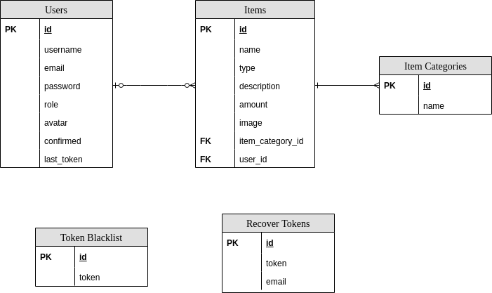

# Games Store (Backend)

Backend for [IPP/ESTG](https://www.estg.ipp.pt/) class "Segurança em Aplicações Web" (Web Application Security) **[Project](https://github.com/ighour/games-store)**.

The main goal was to build my own MVC framework in PHP while taking some security measures.

## Built With

* [Composer](https://getcomposer.org/) - Dependency manager for PHP.
* [Dotenv](https://symfony.com/doc/current/components/dotenv.html) - Symfony 4 component to enable enviroment variables.
* [Php](http://php.net/) - Programming language.
* [PHPMailer](https://github.com/PHPMailer/PHPMailer) - Library to send email in PHP.
* [Php-Jwt](https://github.com/firebase/php-jwt) - Library to encode and decode JSON Web Tokens in PHP.
* [MySQL](https://www.mysql.com/) - to store the data.

## Implemented Architecture and Design Patterns

* **MVC** - Basic Model-View-Controller architectural pattern.
* **Web Service** - Application as a web service with JSON responses.
* **REST** - Uses Representational State Transfer pattern to access server resources.

## Main Components and Features

* **DAO** - Data Access Object component implemented with PDO (PHP Data Objects).
* **File Handling** - Handle file store request and return it.
* **JSON Web Token** - Handle backend and frontend communication.
* **Middlewares** - Run self-services to application, like Authentication Middleware and CORS Middleware.
* **Resources** - Defines model transformation before sending in response.
* **Seeds** - Friendly seeds for testing purpose.

## Security Artefacts

* **JSON Web Token** - It is blacklisted on logout and an user can have only one active per time.
* **Sanitization** - Sanitizes all request parameters before proceeding in controllers methods.
* **Validation** - Validate all request parameters before proceeding in controllers methods.
* **Request Parameters** - Parameters are sanitized again with PDO, to prevent code/sql injection.
* **Registration** - Require email confirmation to avoid spamming user creation.
* **Passwords** - Require medium to strong passwords on registering and stores it in database using hashing algorithms with salt.
* **Authentication & Authorization** - Uses a middleware to prevent users (anonymous or authenticated) to manipulate unauthorized resources.
* **Roles** - Categorize users by role to define which actions are authorized to do in application.
* **Server Exceptions** - Handle exceptions and return JSON response with friendly and secure HTTP code, message and payload (optional).
* **CORS** - Explicitly defines allowed origins to make cross-origin resource sharing.

## Modelling

#### **Entity Relationship Diagram**

